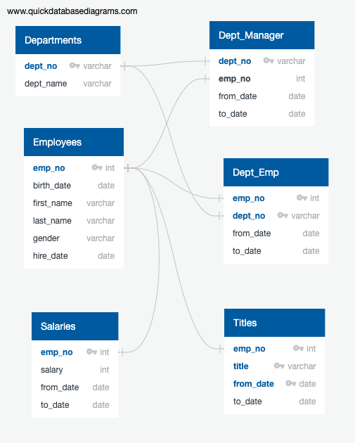

# Pewlett-Hackard-Analysis
## Overview of Analysis
#This analysis was conducted to shed light on how a company will change when mass amounts of employees reach retirement age. Pewlett-Hackard must prepare for anticipated retirements and be ready to fill the roles of those who will leave the company. To create a strategy, SQL was used to determine the total number of employees per title who will be retiring, and identify employees who are eligible to participate in a mentorship program. This information will help Pewlett-Hackard prepare for the “silver tsunami” as many current employees reach retirement age.
#The first step in the analysis was to make an entity-relational diagram as seen below. This image presents the relationships between the various csv files that we are working with. It is benefical to see these relationships visually while creating the SQL script. Reference this table often.

#Initially, I imported the tables with the <CREATE TABLE> function. Once the tables were established, I imported the data directly from the original csv files into PgAdmin for further manipulation. Once the files were imported, I could manipulate the data to show only information that pertained to the question at hand. I initially struggled with importing the csv files becuase there is a unique line of code that should be used with macs. Below is the code that I used to import the csv files. 
COPY departments FROM '/Users/abigailwoolf/Public/departments.csv' DELIMITER ',' CSV HEADER;
COPY employees FROM '/Users/abigailwoolf/Public/employees.csv' DELIMITER ',' CSV HEADER;
COPY dept_emp FROM '/Users/abigailwoolf/Public/dept_emp.csv' DELIMITER ',' CSV HEADER;
COPY dept_manager FROM '/Users/abigailwoolf/Public/dept_manager.csv' DELIMITER ',' CSV HEADER;
COPY salaries FROM '/Users/abigailwoolf/Public/salaries.csv' DELIMITER ',' CSV HEADER;
COPY titles FROM '/Users/abigailwoolf/Public/titles.csv' DELIMITER ',' CSV HEADER;
#Ultimately, I gathered the information that I needed to provide for the client. I created lists of names of people would be good candidates for the mentorship program. This will allow Pewlett-Hackard to ease into the transition when large cohorts of employees retire. A program like this is beneficial in the long-term because will decrease any inconsistencies within the operations department. 

